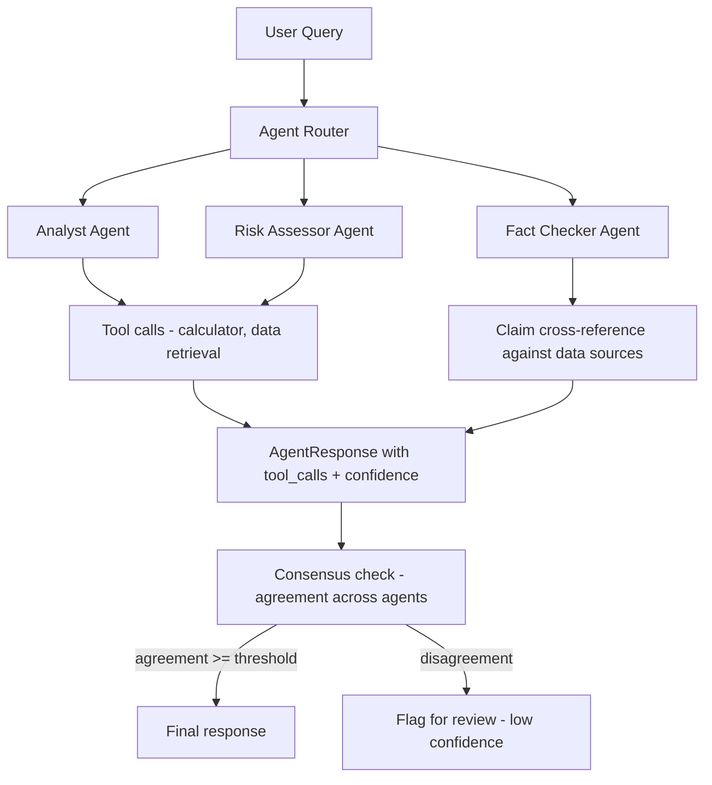

# llm-financial-agent

> Multi-agent financial analysis system with a hallucination detection layer that cross-checks factual claims against authoritative sources before they reach the user

[](https://github.com/jrajath94/llm-financial-agent/actions)
[](https://codecov.io/gh/jrajath94/llm-financial-agent)
[](https://opensource.org/licenses/MIT)
[](https://www.python.org/downloads/)

## Why This Exists

LLMs hallucinate financial figures. A model confidently stating "2023 revenue was $4.2B" when the 10-K says $3.8B is not just wrong — it is a liability. A hallucinated revenue figure feeds into a DCF model, which produces a target price, which triggers a trade. One wrong input cascades into a six-figure loss.

This multi-agent system adds a verification layer: claims about specific financial figures are extracted from the LLM output and cross-checked against source documents before they reach the user. The system uses abstract `LLMProvider` and tool protocols so every component is testable without real API calls — no OpenAI key required to run the test suite.

## Architecture


```mermaid
graph TD
    A[User Query] --> B[Agent Router]
    B --> C[Analyst Agent]
    B --> D[Risk Assessor Agent]
    B --> E[Fact Checker Agent]
    C --> F[Tool calls - calculator, data retrieval]
    D --> F
    E --> G[Claim cross-reference against data sources]
    F --> H[AgentResponse with tool_calls + confidence]
    G --> H
    H --> I[Consensus check - agreement across agents]
    I -->|agreement >= threshold| J[Final response]
    I -->|disagreement| K[Flag for review - low confidence]
```

Agents are defined by an `AgentRole` enum and operate against an abstract `LLMProvider` protocol, making them fully testable with mock implementations. Each agent executes tool calls (`CALCULATOR`, `DATA_RETRIEVAL`, `SEARCH`), records the results, and produces an `AgentResponse` with a confidence score. The `ConsensusEngine` collects responses from multiple agents and returns the result only when a configurable agreement threshold is met — otherwise it flags the response as low-confidence for human review.

## Quick Start

```bash
git clone https://github.com/jrajath94/llm-financial-agent.git
cd llm-financial-agent
make install && make test
```

```python
from llm_financial_agent import (
    Agent,
    AgentRole,
    ConsensusEngine,
    HallucinationDetector,
)

# Hallucination detection scores a claim against known data
detector = HallucinationDetector(threshold=0.6)
score = detector.score_claim(
    claim="Apple Q1 FY2024 revenue was $119.6 billion",
    context="Apple reported revenue of $119.6 billion for Q1 FY2024",
)
print(f"Confidence: {score:.2f}")  # high confidence — claim matches context

# Multi-agent consensus
engine = ConsensusEngine(min_agents=2, agreement_threshold=0.7)
# Add agents, collect responses, check consensus
```

## Key Design Decisions

| Decision | Rationale | Alternative Considered | Tradeoff |
|----------|-----------|----------------------|----------|
| Abstract `LLMProvider` protocol | All LLM interactions go through a `Protocol` interface — the test suite runs entirely with mock implementations, no API keys required | Hardcode OpenAI SDK | More boilerplate but test coverage doesn't depend on external services or costs |
| `ConsensusEngine` with configurable threshold | Multiple agents produce independent assessments; consensus flags disagreements before they reach users | Single-agent with high temperature | Multi-agent consensus adds latency but surfaces uncertainty that single-agent responses hide |
| `HallucinationDetector` as standalone component | Claim verification can be applied to any text, not just agent outputs; composable with RAG pipelines | Embed detection inside agent loop | More flexible — can retrofit onto existing LLM pipelines without changing the generation step |
| Agent memory capped at `MAX_MEMORY_SIZE` | Prevents unbounded context growth in long sessions; oldest entries are evicted | Unlimited memory | Slight loss of long-term context but predictable latency and token usage |
| Tool calls recorded on `AgentResponse` | Full audit trail of what data each agent used to reach its conclusion | Summary only | Higher output verbosity but enables debugging and compliance review |

## Testing

```bash
make test    # Full test suite — no API keys required
make lint    # Ruff + mypy
```

## License

MIT — Rajath John
